# claude-checklist — Claude Code checklist plugin

**Ask before you build.** A checklist plugin (skill + hook) for Claude Code that makes Claude run a short, multi-round Q&A before any new task,
save the agreement as a BRIEF, and check the result against it before calling the work done.

[한국어](README.ko.md)



## What it does

- **Q&A checklist (`/checklist`)** — for new work: 1–4 rounds of questions sized to the job, each with a recommended answer
  first (or "take the recommendations for everything else") →
  summary that separates *what you said* from *what Claude assumed* → your approval → BRIEF saved → work →
  a done-check table against the BRIEF at the end.
- **Size call up front** — on every request Claude says in one line whether it treats it as new work (questions first)
  or a continuation / small fix (no checklist), so you can overrule it.
- **Your language** — one skill, no language packs. Questions, summaries, BRIEFs and learned files follow the
  language you write in.
- **Learns your rules** — when you correct the same thing twice or say "from now on…", Claude proposes a one-line
  rule. Approved rules go to `~/.claude/checklist/rules.md` and are loaded in every session.
- **Learns your fields** — when a task doesn't match a known field, Claude drafts a field question list from the
  Q&A you just had. Approved, it's saved to `~/.claude/checklist/fields/<field>.md` and used next time.
- **Learns from misses** — every ⚠️ / ❌ in the done check, or a fix you ask for after "done", becomes a proposed
  question for that field: *"Next time, ask: …?"*. The checklist gets sharper the more you use it.
- **Picks up where you left off** — open a session in a folder with an open BRIEF and Claude is told where it is.

Nothing is saved without your approval.

## Why this one?

| | Best for | What this plugin adds |
|---|---|---|
| **Plan mode** (built in) | Reviewing Claude's plan before it edits code | Questions with recommended answers, a *don'ts* list, and a done check that is kept after the session ends |
| **[superpowers](https://github.com/obra/superpowers)** brainstorming | A full coding workflow (design → plan → TDD) | A light, single skill, and fields outside coding (3D, docs, design) |
| **[spec-kit](https://github.com/github/spec-kit)** | Spec-driven software projects with specs in the repo | Sized to the task: one round for small jobs. The BRIEF lives outside the repo |
| **CLAUDE.md** | Rules that always apply | An agreement *per task*, checked at the end. Rules are learned from your corrections, not written by hand |

What only this does: the BRIEF is **tied to the folder** and comes back when you reopen it; the **don'ts** are checked
line by line before "done"; and **misses become questions** for next time.

## What it looks like

```
You:    I want a small CLI tool that renames my photo files by date.
Claude: Treating this as new work — questions first.
        I looked around: ./photos-tool is empty, Python 3.12 is installed, no exiftool.

        Round 1 — goal and output
        1. Where does the date come from?
           > EXIF "date taken", falling back to modified time (Recommended)
             EXIF only · modified time only
        2. New name format?
           > 2026-10-01_143052.jpg (Recommended) · 20261001_143052.jpg · keep original name
        ...
```

Full walk-through — rounds, summary, approval, done-check table, a learned rule: [examples/session.md](examples/session.md).
The BRIEF it saves: [examples/brief.md](examples/brief.md).

## Install

Requires Claude Code and `node` on your PATH (for the session-start hook; no npm packages).

```
claude plugin marketplace add FRe2Hug/claude-checklist
claude plugin install claude-checklist@claude-checklist
```

Or inside Claude Code: `/plugin marketplace add FRe2Hug/claude-checklist` → `/plugin install claude-checklist@claude-checklist`.

Start a new session, then just ask for something new — or type `/checklist <what you want>`.

**Skill only (no plugin):** copy `plugin/skills/checklist/` to `~/.claude/skills/checklist/` and call `/checklist` yourself.
You lose the session-start hook: no automatic size call, no user rules or open-BRIEF reminders.

**Turn it off:** `claude plugin disable claude-checklist@claude-checklist`.

## Your files

Everything you teach it lives outside the plugin, so updates never overwrite it.

| Path | What |
|---|---|
| `~/.claude/checklist/rules.md` | Your rules, one per line, injected every session. Edit freely. |
| `~/.claude/checklist/fields/*.md` | Your field question lists (used before the built-in ones). |
| `~/.claude/checklist/briefs/*.md` | BRIEFs. Set `status: done` (or `closed`, or the word in your language, e.g. `완료`, `完了`, `terminé`) to stop the reminder. |

Set `CHECKLIST_HOME` to use a different folder.

## Built-in fields

`coding`, `docs`, `design`, `3d-modeling`, `3d-print` — in `plugin/skills/checklist/fields/`. Add your own by copying the format, e.g.
`~/.claude/checklist/fields/data-analysis.md`:

```markdown
# Field: data analysis

- **Question**: what decision the analysis should support
- **Data**: source, size, how fresh, known gaps
- **Output**: notebook / chart / one-page summary
- [Don't candidates] charts without the question answered, silently dropping rows
```

## Development

Tests for the session hook: `node --test test/session_start.test.js` (Node 18+, no dependencies).

## Credits

Ideas borrowed from [obra/superpowers](https://github.com/obra/superpowers) (brainstorming: approval gate,
play back what you understood) and [mattpocock/skills](https://github.com/mattpocock/skills) (grilling: decision-tree
rounds, recommended answers).

## License

MIT
